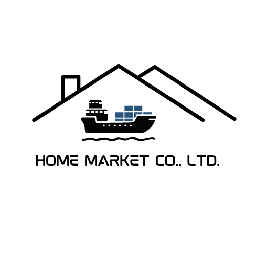

# Home Market Co.,Ltd. - Landing Page



## Descripción

Este proyecto es un sitio web corporativo para Home Market Co.,Ltd., una empresa global de comercio que proporciona una amplia gama de productos. El sitio web está construido con tecnologías modernas para ofrecer una experiencia de usuario fluida y atractiva.

## Tecnologías Utilizadas

- **Next.js 15.1.0**: Framework de React con renderizado del lado del servidor
- **React 19**: Biblioteca para interfaces de usuario
- **TypeScript**: Tipado estático para JavaScript
- **Tailwind CSS**: Framework de CSS para diseño rápido y responsivo
- **Framer Motion**: Biblioteca para animaciones
- **Radix UI**: Componentes accesibles y sin estilos
- **Zod**: Validación de esquemas

## Estructura del Proyecto

```
home-market-landing/
├── app/                  # Directorio principal de Next.js
│   ├── layout.tsx        # Layout principal
│   ├── page.tsx          # Página de inicio
│   └── globals.css       # Estilos globales
├── components/           # Componentes reutilizables
│   ├── ui/               # Componentes de UI básicos
│   ├── hero.tsx          # Sección de héroe
│   ├── mission-vision.tsx# Sección de misión y visión
│   ├── core-business.tsx # Sección de negocio principal
│   ├── partners.tsx      # Sección de socios
│   ├── testimonials.tsx  # Sección de testimonios
│   ├── contact-form.tsx  # Formulario de contacto
│   ├── header.tsx        # Encabezado del sitio
│   └── footer.tsx        # Pie de página
├── public/               # Archivos estáticos
├── styles/               # Estilos adicionales
├── lib/                  # Utilidades y helpers
├── hooks/                # Custom hooks de React
└── utils/                # Funciones utilitarias
```

## Características Principales

1. **Diseño Responsive**: Adaptable a diferentes tamaños de pantalla
2. **Animaciones Fluidas**: Utilizando Framer Motion para mejorar la experiencia de usuario
3. **Navegación Suave**: Desplazamiento suave entre secciones
4. **Formulario de Contacto**: Para comunicación directa con clientes potenciales
5. **Secciones Informativas**: Presentación clara de la misión, visión y servicios de la empresa

## Secciones del Sitio

- **Hero**: Presentación principal de la empresa
- **Misión y Visión**: Valores y objetivos corporativos
- **Negocio Principal**: Servicios y área de especialización
- **Socios**: Colaboradores y clientes destacados
- **Testimonios**: Opiniones de clientes satisfechos
- **Contacto**: Formulario para comunicación directa

## Requisitos

- Node.js 18.0 o superior
- pnpm (recomendado) o npm

## Instalación

1. Clonar el repositorio:
   ```bash
   git clone [url-del-repositorio]
   cd home-market-landing
   ```

2. Instalar dependencias:
   ```bash
   pnpm install
   ```

3. Iniciar el servidor de desarrollo:
   ```bash
   pnpm dev
   ```

4. Abrir [http://localhost:3000](http://localhost:3000) en el navegador

## Scripts Disponibles

- `pnpm dev`: Inicia el servidor de desarrollo
- `pnpm build`: Construye la aplicación para producción
- `pnpm start`: Inicia la aplicación en modo producción
- `pnpm lint`: Ejecuta el linter para verificar errores

## Despliegue

Este proyecto puede ser desplegado en cualquier plataforma que soporte Next.js, como:

- Vercel
- Netlify
- AWS Amplify
- Servidor propio con Node.js

## Contribución

Para contribuir al proyecto:

1. Hacer fork del repositorio
2. Crear una rama nueva (`git checkout -b feature/nueva-caracteristica`)
3. Hacer commit de los cambios (`git commit -m 'Añadir nueva característica'`)
4. Hacer push a la rama (`git push origin feature/nueva-caracteristica`)
5. Crear un Pull Request

## Licencia

Este proyecto está bajo licencia privada para Home Market Co.,Ltd.

## Contacto

Para más información, contactar a Home Market Co.,Ltd. a través del formulario de contacto en el sitio web. 